# National Real Estate Prices (Python)

Python port of [mgrodecki/National-Real-Estate-Prices](https://github.com/mgrodecki/National-Real-Estate-Prices), preserving the original workflow from `Final Project.Rmd`:

- load CPI, mortgage, and housing index datasets
- derive monthly/quarterly inflation-rate series
- generate correlation views and regression charts
- run k-means clustering for the same dataset variants

## Project Layout

- `data/`: source datasets copied from the original repo
- `src/analysis.py`: end-to-end Python analysis pipeline
- `outputs/`: generated CSV summaries and PNG charts

## Notes on CPI Data

The original repository references `CPI-U.csv` but does not include it.

This Python version auto-downloads CPI data from FRED (`CPIAUCSL`) into `data/CPI-U.csv` if that file is missing.

## Refresh Data (Latest Available)

```bash
python src/update_data.py
```

This refreshes:

- `CPI-U.csv` from FRED `CPIAUCSL`
- `30_year_mortgate_rates.csv` from FRED `MORTGAGE30US` (weekly -> monthly average)
- Housing index CSVs from FHFA `hpi_master.csv`

## Run Analysis

```bash
python -m pip install -r requirements.txt
python src/analysis.py
```

## Generate HTML Report

```bash
python src/generate_html_report.py
```

This writes:

- `outputs/up_to_date_analysis_report.html`

## HTML Visualizations

- Open the full dashboard: [outputs/up_to_date_analysis_report.html](outputs/up_to_date_analysis_report.html)

### Preview: Core Trend Charts

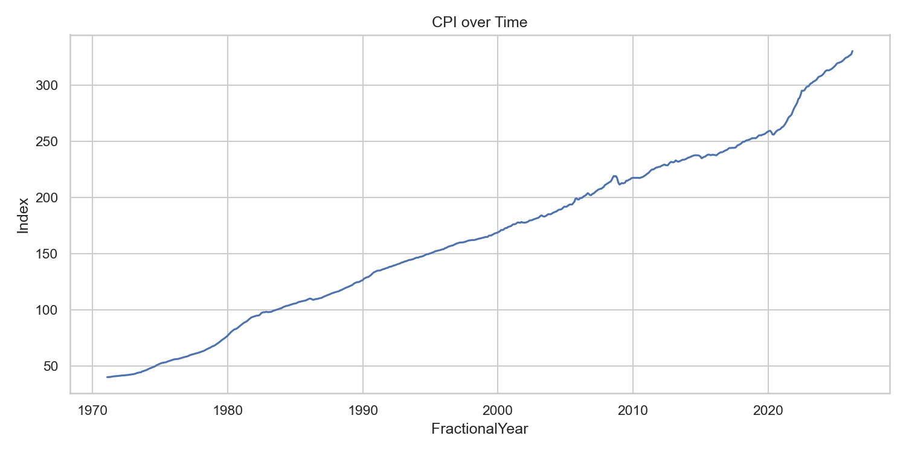
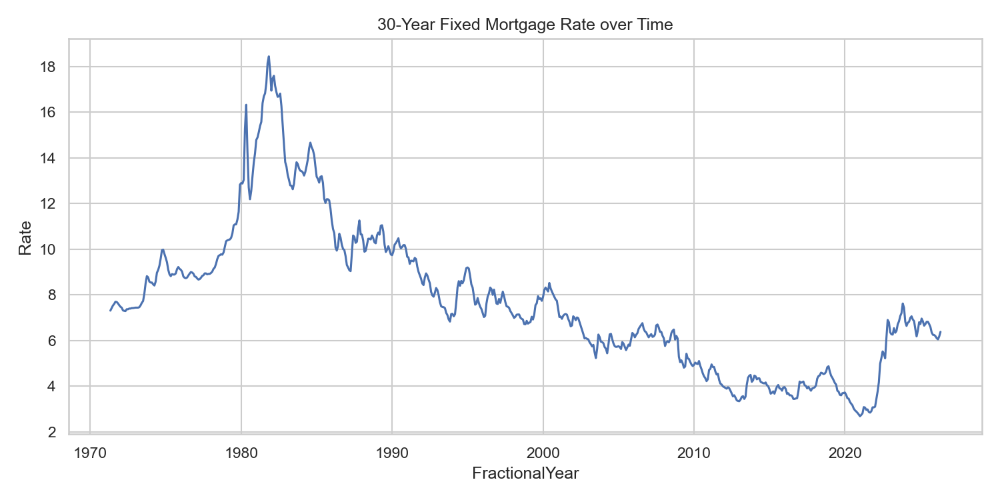
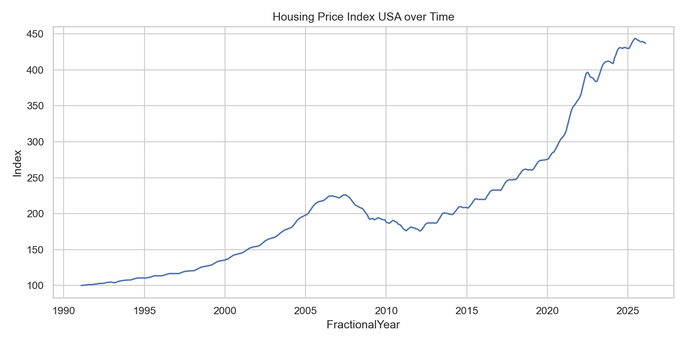
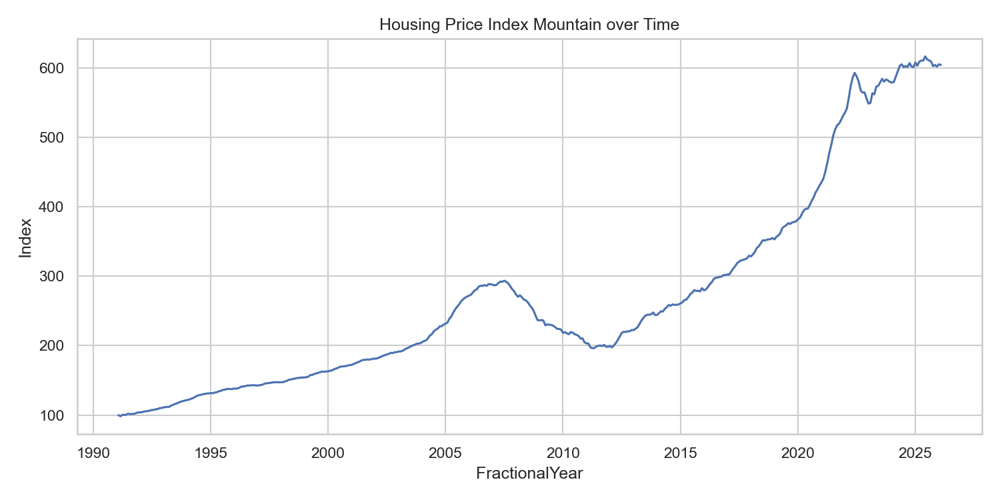

### Preview: Key Relationship Charts

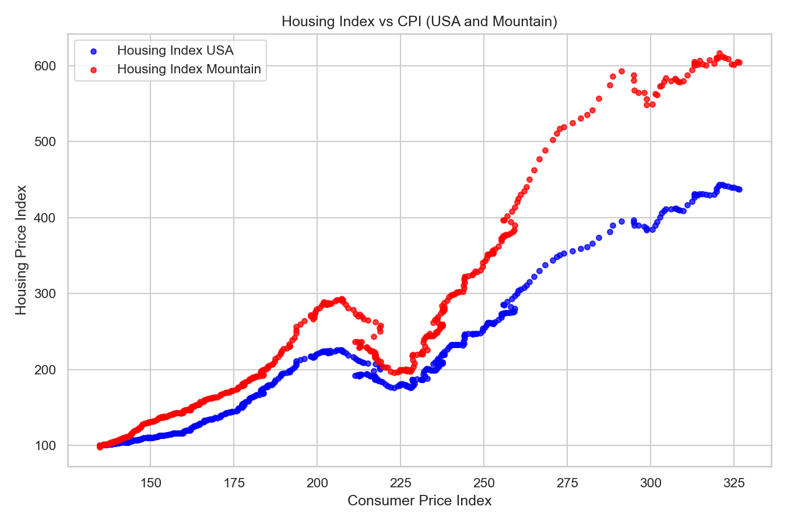
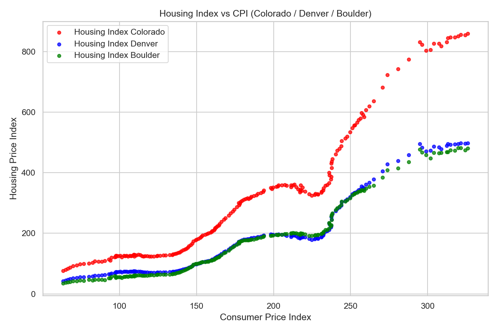
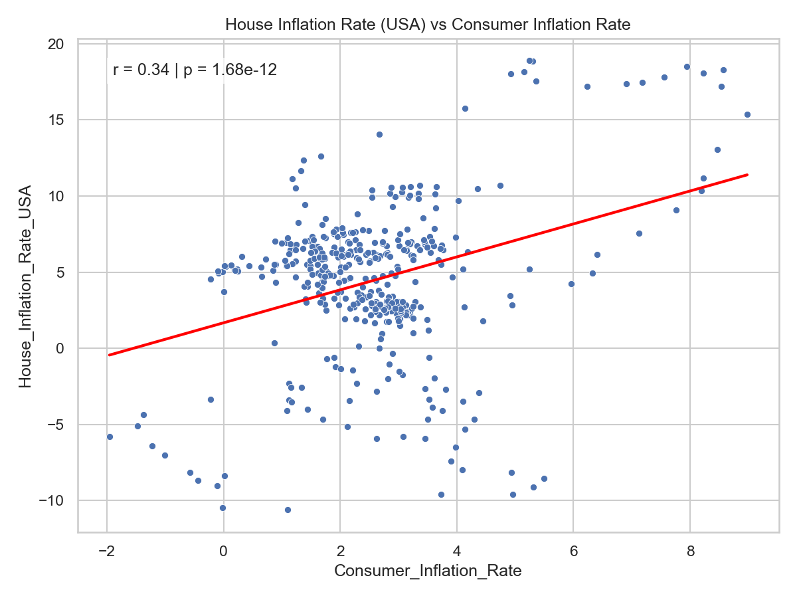
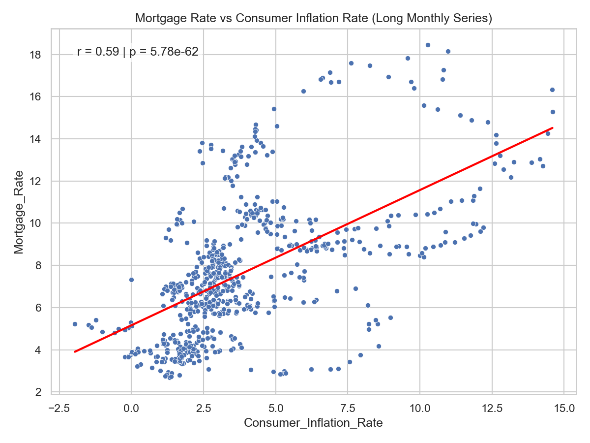

### Preview: Correlation and Clustering

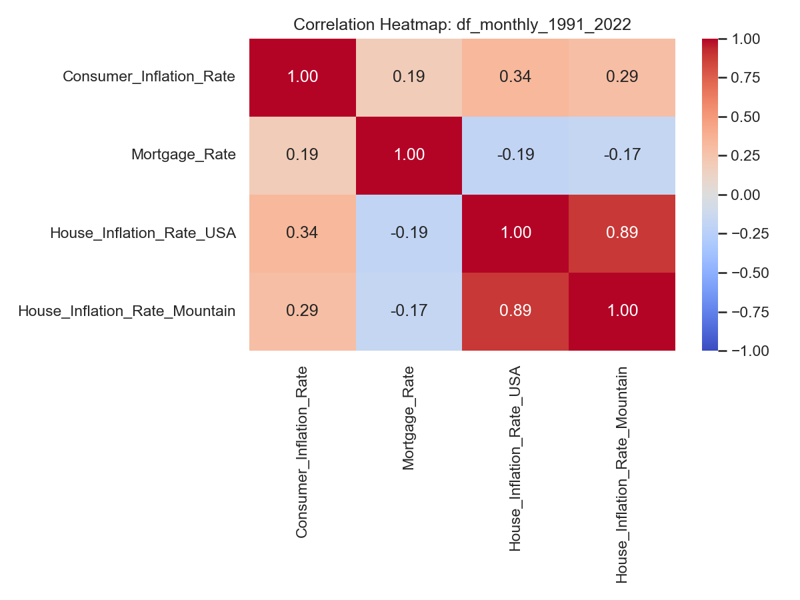
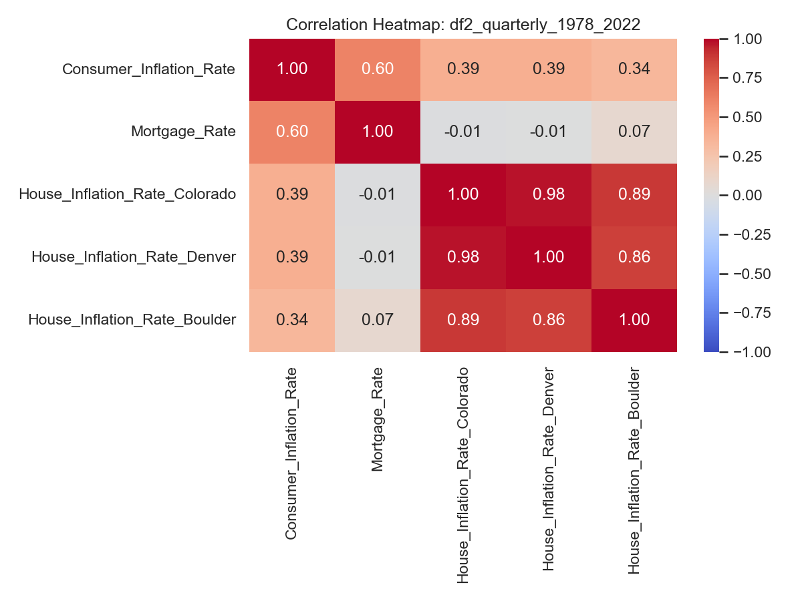
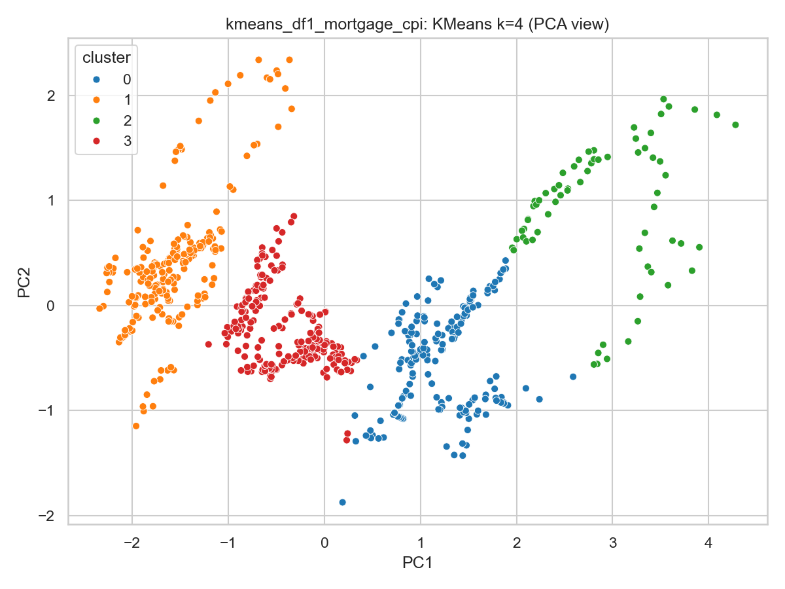
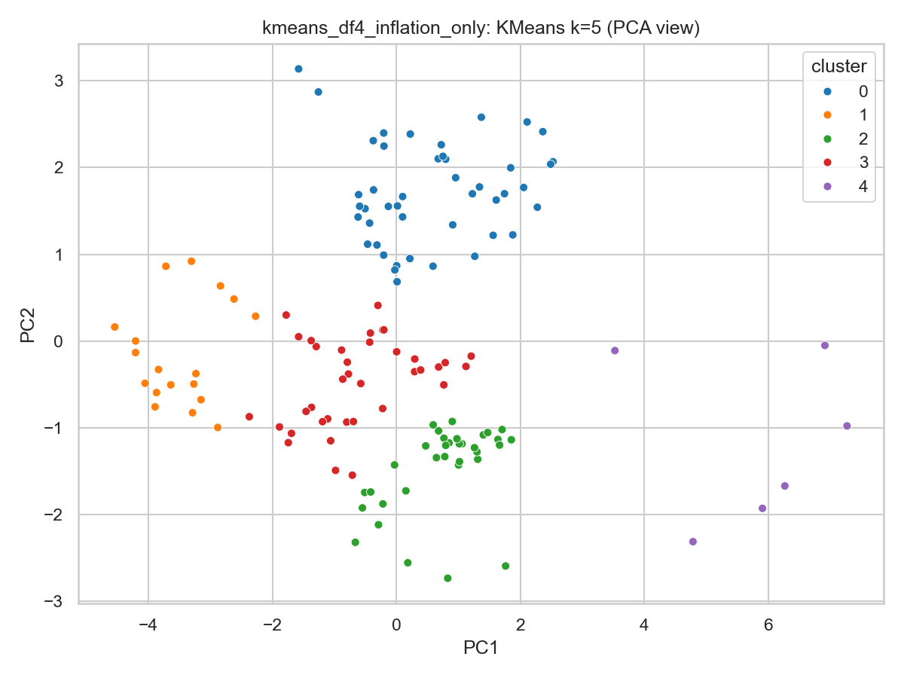

After running, review:

- `outputs/regression_summary.csv`
- `outputs/*_corr.csv`
- `outputs/*.png`

## Original Source

- Original R project: `data/Final Project.Rmd`
- Upstream repo: <https://github.com/mgrodecki/National-Real-Estate-Prices>
